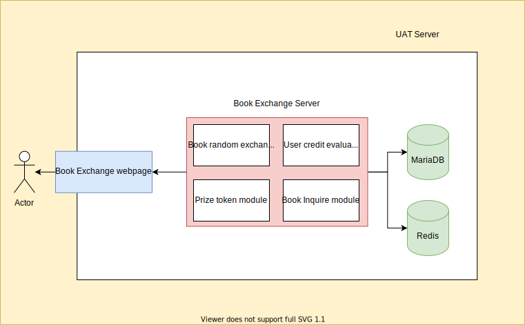
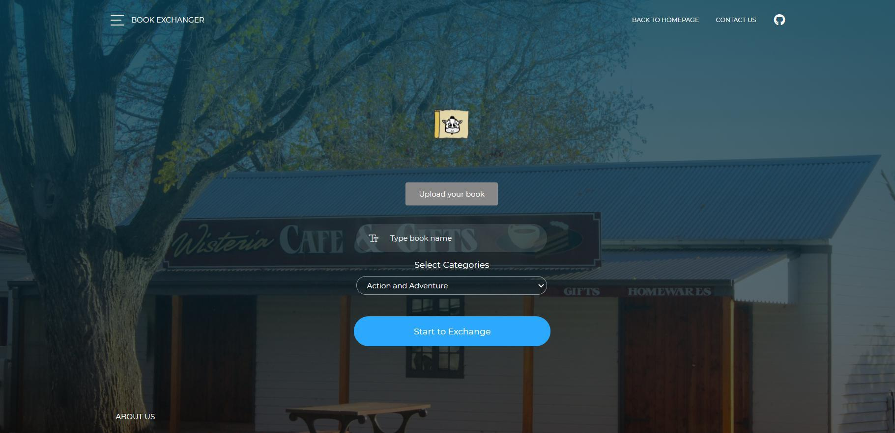
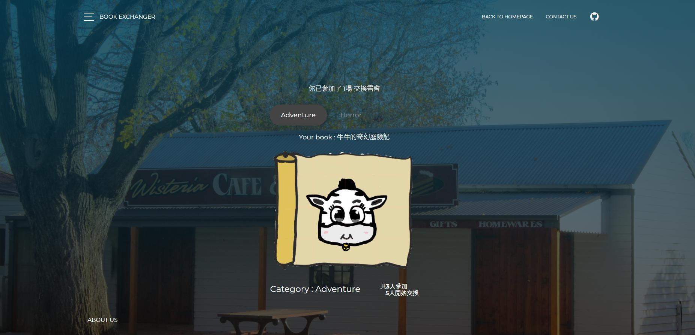
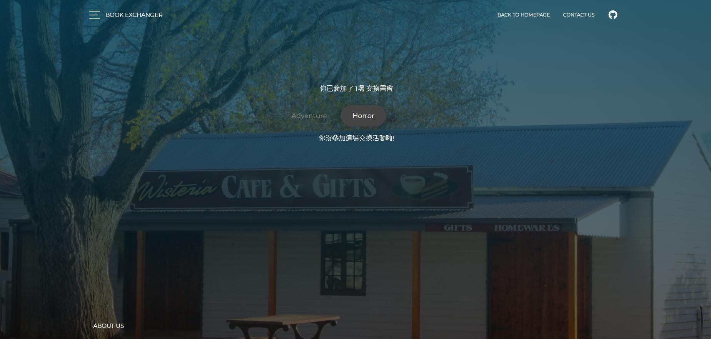

# BookExchange webservie
The plateform for people to exchange to second hands book, the user is able to create a exchange group and generate the link or send the mail to invite others to join the group and doing the book exchange. The webservice is build by using golang 1.15 with Restful api service structure, as for the data storage, the mariadb and redis is implemented to handle the data which generated by the webservice.

## Features

- RestfulAPI structure
- Connect with Redis

## Strutures



## Executions

- compile and execute
```
$ make build
$ ./build/build
```

- run 
```
make run
```

- docker start
```
docker-compose up
```

- docker stop
```
docker-compose down
```

## Expected webpages
`Login page`


`Upload your books`


`Join a exchange group`

